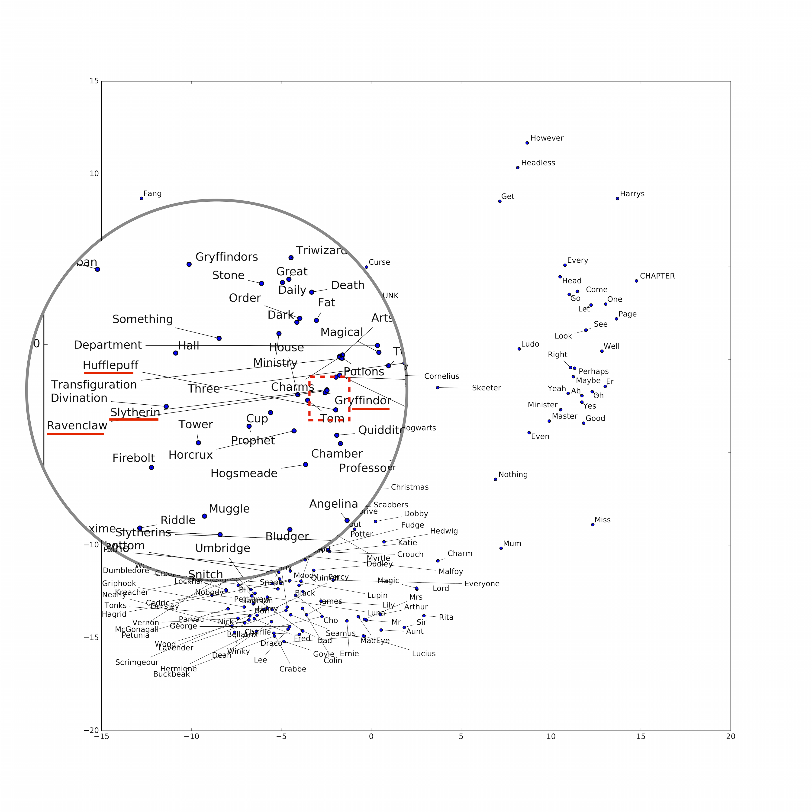

# word2vec4everything

*word2vec for (almost) everything*

Processing some interesting text documents through the word2vec machine learning model and visualizing the resulting vectors to discover the relationships and clusters that come up.

## Table of Contents

* [Brief Introduction to word2vec](#brief-introduction-to-word2vec)
* [Dependencies](#dependencies)
* [Gallery](#gallery)
    * [word2vec Paper](#word2vec-paper)
    * [Harry Potter](#harry-potter)
    * [The Fellowship of the Ring](#the-fellowship-of-the-ring)
    * [The Bible, King James version](#the-bible-king-james-version)
    * [The Chronicles of Narnia](#the-chronicles-of-narnia)
    * [Ender's Game](#enders-game)
* [References](#references)

## Brief Introduction to word2vec

As explained on [Wikipedia](https://en.wikipedia.org/wiki/Word2vec), `word2vec` refers to a number of machine learning models that take a corpus of text and output a vector space of word embeddings.
The word2vec model was created at Google by a team of Tomas Mikolov et al. in 2013 and has since been adapted in numerous papers. 
The resulting word vectors can be visualized in such a way that words with similar semantic meanings and contexts are clustered together. 
As an unsupervised machine learning technique, the input text that is fed into the word2vec model doesn't require any labels.
This makes it all the more interesting when the final vector visualizations show that semantically related words are clustered together.

The [t-distributed Stochastic Neighbor Embedding](https://en.wikipedia.org/wiki/T-distributed_stochastic_neighbor_embedding) (t-SNE) technique is used to visualize the final word2vec embeddings onto a 2-dimensional space.

## Dependencies

This project implements word2vec (Skip-gram model) using Google's TensorFlow library in Python 2.x. 
Plenty of other libraries are also used: matplotlib, nltk, and sklearn, among others.

Installing TensorFlow locally using the Anaconda, Python 2.7 instructions ([TensorFlow link](https://www.tensorflow.org/get_started/os_setup)) :
```
# Creating the environment through a conda command
$ conda create -n tensorflow python=2.7

# Activate the environment. This causes the terminal prompt to change.
$ source activate tensorflow
(tensorflow)$ # The new prompt for the conda environment

# Installing TensorFlow.
$ conda install -c conda-forge tensorflow

# Deactivate the environment to return to the usual prompt.
(tensorflow)$ source deactivate
$ # Back to normal
```

The TensorFlow scripts in the `python` directory are modifications to the starter code provided in the TensorFlow tutorials: [Vector Representations of Words](https://www.tensorflow.org/tutorials/word2vec/).
Modifications include:
- Python PEP8 styling changes
- General refactoring 
- Further code to adjust the visualization step

Running on the command line is as simple as
```
$ python python/word2vec4everything-basic.py --input_data=path/to/data 
```

## Gallery

These are a selection of the most interesting visualizations that have been produced by word2vec4everything. 
This project is somewhat limited by the public availability of texts on the Internet. :)

### word2vec Paper

- Data: ~30 KB - A plaintext file of one of the word2vec papers: Mikolov, T., Chen, K., Corrado, G., & Dean, J. (2013). Efficient estimation of word representations in vector space. arXiv preprint arXiv:1301.3781.
- Comment: This was a bit of a meta experiment. It's nice to see a cluster for some of the neural networks named in the paper (NNLM, RNNLM, RNN) as well as the two different word2vec models (CBOW, Skipgram). This was replicated to some degree in other iterations but may require some other finetuning. 
- Command line: `$ python python/word2vec4everything-basic.py --input_data=data/word2vec-paper.txt --train_steps=200000 --vocab_size=1000 --plot_count=500`


### Harry Potter

- Data: ~10 MB - A plaintext file of all 7 Harry Potter books. Found with the help of some Google-fu.
- Comment: word2vec clusters the 4 houses of Hogwarts (Gryffindor, Hufflepuff, Ravenclaw, and Slytherin) together. The visualization is admittedly quite complicated and messy because this was processed by an earlier version of the script.




### The Fellowship of the Ring

- Data: ~1 MB - A plaintext file of the first book in The Lord of the Rings book series.
- Comment: word2vec clusters the members of the Fellowship of the Ring: Frodo, Sam, Gandalf, Legolas, Gimli, Aragorn, Boromir, Merry, and Pippin. It's also neat that 'Strider' (an alias) is quite close to Aragorn. Sauron, Saruman, and Gollum are also relatively distant from the Fellowship.
- Command line: `$ python python/word2vec4everything-basic.py --input_data=data/lotr-all.txt  --train_steps=200000 --plot_count=500  --whitelist_labels=Frodo,Sam,Gandalf,Legolas,Gimli,Aragorn,Boromir,Merry,Pippin,Gollum,Sauron,Saruman,Balrog,Galadriel`


### The Bible, King James version

- Data: ~4.4 MB - A plaintext file of the Bible, King James version.
- Comment: There seems to be a distinct cluster for the "God" related words and a separate cluster for the prominent people in the source text. Running the script again seems to replicate this interesting finding.
- Command line: `$ python python/word2vec4everything-basic.py --input_data=data/bible-kjv.txt  --train_steps=200000 --plot_count=750 --whitelist_labels=Jesus,Mary,Simon,Peter,Andrew,James,John,Philip,Bartholomew,Thomas,Matthew,Thaddaeus,Judas`


### The Chronicles of Narnia

- Data: ~1.7 MB - A plaintext file of all books in the Chronicles of Naria.
- Comment: Aslan, an important character in the series, seems to be an outlier from the cluster of other main characters. However, replicating this in other iterations doesn't quite support this as strongly.
- Command line: `$ python python/word2vec4everything-basic.py --input_data=data/chronicles-of-narnia.txt  --train_steps=200000  --plot_count=500 --whitelist_labels=Aslan,Peter,Susan,Edmund,Lucy,Eustace,Jill,Digory,Polly,Prince,Caspian,Reepicheep,Jadis,Shasta,Aravis,Bree,Tumnus,Trumpkin,Puddlegum,Tirian`
 


### Ender's Game

- Data: ~500 KB - A plaintext file of the novel Ender's Game.
- Comment: As expected, Ender and his team are clustered together. Locke and Demosthenes maintain some distance. It would be interesting if further training reveals distinct clusters between the Battle School trainees and the school's top military brass.
- Command line: `$ python python/word2vec4everything-basic.py --input_data=data/enders-game.txt  --train_steps=200000  --plot_count=750 --whitelist_labels=Ender,Valentine,Peter,Colonel,Graff,Mazer,Rackham,Major,Anderson,Bean,Alai,Dink,Petra,Bonzo,Bernard,Stilson`


## References

More information on word2vec as follows. Some of the papers are referenced according to the APA style.

The original papers by Mikolov et al.: 

- Mikolov, T., Chen, K., Corrado, G., and Dean, J. (2013). Efficient estimation of word representations in vector space. arXiv preprint arXiv:1301.3781. Retrieved from https://arxiv.org/abs/1301.3781 
- Mikolov, T., Sutskever, I., Chen, K., Corrado, G. S., and Dean, J. (2013). Distributed representations of words and phrases and their compositionality. In Advances in Neural Information Processing Systems, pages 3111–3119. Retrieved from http://papers.nips.cc/paper/5021-distributed-representations-of-words-and-phrases-and-their-compositionality.pdf
- Mikolov, T., Yih, W. T., & Zweig, G. (2013, June). Linguistic Regularities in Continuous Space Word Representations. In HLT-NAACL (Vol. 13, pp. 746-751). Retrieved from http://www.aclweb.org/anthology/N13-1#page=784

The TensorFlow tutorial:

- Vector Representations of Words. https://www.tensorflow.org/tutorials/word2vec/ 

Other resources that explain or extend word2vec:

- word2vec. Wikipedia article. https://en.wikipedia.org/wiki/Word2vec
- Levy, O., & Goldberg, Y. (2014). Neural word embedding as implicit matrix factorization. In Advances in neural information processing systems (pp. 2177-2185). Retrieved from http://papers.nips.cc/paper/5477-scalable-non-linear-learning-with-adaptive-polynomial-expansions.pdf
- Rong, X. (2014). word2vec parameter learning explained. arXiv preprint arXiv:1411.2738. Retrieved from https://arxiv.org/abs/1411.2738
- Colyer, A. (April 2016). The amazing power of word vectors. Retrieved from https://blog.acolyer.org/2016/04/21/the-amazing-power-of-word-vectors/
- McCormick, C. (April 2016). Word2Vec Tutorial - The Skip-Gram Model. Retrieved from http://mccormickml.com/2016/04/19/word2vec-tutorial-the-skip-gram-model/
- Olah, C. (July 2014). Deep Learning, NLP, and Representations. Retrieved from http://colah.github.io/posts/2014-07-NLP-RNNs-Representations/

Some resources that cover the t-SNE dimensionality reduction technique used for the visualization step:

- t-distributed stochastic neighbor embedding. Wikipedia article. https://en.wikipedia.org/wiki/T-distributed_stochastic_neighbor_embedding
- Maaten, L. V. D., & Hinton, G. (2008). Visualizing data using t-SNE. Journal of Machine Learning Research, 9(Nov), 2579-2605. Retrieved from http://www.jmlr.org/papers/volume9/vandermaaten08a/vandermaaten08a.pdf
- An illustrated introduction to the t-SNE algorithm. O'Reilly Media. https://www.oreilly.com/learning/an-illustrated-introduction-to-the-t-sne-algorithm


